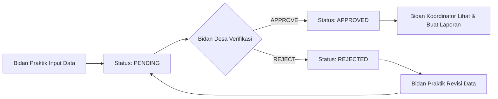

# 📘 API Documentation - SiBidan (Sistem Informasi Bidan Puskesmas)

## 📑 Table of Contents

1. [Quick Start Guide](#quick-start-guide)
2. [Overview & Business Concept](#overview--business-concept)
3. [Authentication & Authorization](#authentication--authorization)
4. [Role-Based Access Control](#role-based-access-control)
5. [Data Models & Relationships](#data-models--relationships)
6. [API Endpoints](#api-endpoints)
   - [Authentication](#1-authentication)
   - [User Management](#2-user-management)
   - [Dashboard](#3-dashboard)
   - [Service Modules](#4-service-modules-health-data)
   - [Master Data](#5-master-data)
   - [Reports](#6-reports--export)
7. [HTTP Status Codes & Error Handling](#http-status-codes--error-handling)
8. [Pagination & Filtering](#pagination--filtering)
9. [Frontend Integration Best Practices](#frontend-integration-best-practices)
10. [API Response Examples](#api-response-examples)
11. [Troubleshooting](#troubleshooting)
12. [Changelog](#changelog)

---

## Quick Start Guide

### 🚀 Setup Environment

```javascript
// Base URL Configuration
const BASE_URL = 'http://localhost:9090/api';

// Required Headers
const headers = {
  'Content-Type': 'application/json',
  'Authorization': 'Bearer YOUR_ACCESS_TOKEN' // For protected endpoints
};
```

### ✅ Quick Authentication Flow

```javascript
// 1. Login
const loginResponse = await fetch(`${BASE_URL}/login`, {
  method: 'POST',
  headers: { 'Content-Type': 'application/json' },
  body: JSON.stringify({
    email: 'admin@puskesmas.local',
    password: 'admin123'
  })
});

const { data } = await loginResponse.json();
const accessToken = data.accessToken;

// 2. Store token (choose one)
localStorage.setItem('token', accessToken); // Persistent
sessionStorage.setItem('token', accessToken); // Session only


// 3. Get User Profile
const profileResponse = await fetch(`${BASE_URL}/profile`, {
  headers: {
    'Authorization': `Bearer ${accessToken}`
  }
});

const profile = await profileResponse.json();
console.log(profile.data); // User info with role, position, village, practice_place
```

### 🔍 Quick Reference by Developer Task

| Task | Go To Section |
|------|---------------|
| Implement Login/Logout | [Authentication](#1-authentication) |
| Implement User CRUD | [User Management](#2-user-management) |
| Implement Dashboard | [Dashboard](#3-dashboard) |
| Implement Data Entry Forms | [Service Modules](#4-service-modules-health-data) |
| Implement Master Data | [Master Data](#5-master-data) |
| Implement Reports/Export | [Reports](#6-reports--export) |

---

## Overview & Business Concept

### 🎯 What is SiBidan?

**SiBidan** (Sistem Informasi Bidan) adalah sistem informasi kesehatan untuk mengelola data pelayanan kesehatan ibu dan anak di tingkat Puskesmas. Sistem ini memfasilitasi proses pencatatan, verifikasi, dan pelaporan data pelayanan kesehatan yang dilakukan oleh bidan di wilayah kerja Puskesmas.

### 🏥 Domain Bisnis

- **Target Users:** Bidan di wilayah kerja Puskesmas (Praktik, Desa, Koordinator) dan Administrator
- **Main Purpose:** Digitalisasi pencatatan data kesehatan ibu dan anak dengan mekanisme verifikasi berjenjang
- **Key Feature:** Workflow approval untuk memastikan kualitas data sebelum dijadikan laporan resmi

### 👥 4 Role Utama

| Role | Deskripsi | Tanggung Jawab |
|------|-----------|----------------|
| **ADMIN** | Super user dengan akses penuh | Kelola user, master data, konfigurasi sistem, akses seluruh data |
| **Bidan Koordinator** (`bidan_koordinator`) | Koordinator tingkat Puskesmas | Lihat data **APPROVED** lintas desa, buat rekapitulasi & laporan |
| **Bidan Desa** (`bidan_desa`) | Verifikator di tingkat desa | Verifikasi (approve/reject) data dari Bidan Praktik **di desa yang ditugaskan** |
| **Bidan Praktik** (`bidan_praktik`) | Inputter data pelayanan | Input data pelayanan kesehatan **di tempat praktik sendiri** |


### 📋 4 Modul Pelayanan Utama

| Modul | Deskripsi | Data Khusus |
|-------|-----------|-------------|
| **Pemeriksaan Kehamilan** | Pencatatan ANC (Antenatal Care) | GPA, umur kehamilan, TD, LILA, BB, Resti, Status TT + Lab Report (HIV, HBsAg, Sifilis, HB, Golongan Darah) |
| **Persalinan** | Pencatatan kelahiran/persalinan | Gravida, Para, Abortus, Vitamin (K, A Bufas), HB-0 + Keadaan Ibu (baik, HAP, partus lama, pre-eklamsi, hidup) + Keadaan Bayi (PB, BB, jenis kelamin, asfiksia, RDS, cacat bawaan, hidup) |
| **Keluarga Berencana** | Pencatatan pelayanan KB | Jumlah anak (L/P), AT (Abortus Terancam), Alat Kontrasepsi (PIL, SUNTIK, IMPLANT, IUD, KONDOM, MOW, MOP, MAL) |
| **Imunisasi** | Pencatatan imunisasi bayi/anak | Jenis imunisasi (HB_0, BCG, DPT_1-3, Polio_1-4, Campak), BB, Suhu, Nama Orang Tua |

### 🔄 Workflow Verifikasi Data



**Penjelasan Workflow:**

1. **Input Data (Bidan Praktik)**
   - Bidan Praktik input data pelayanan kesehatan di tempat praktiknya
   - Data otomatis berstatus `PENDING` menunggu verifikasi
   - `practice_id` otomatis terisi dari data user yang login

2. **Verifikasi (Bidan Desa)**
   - Bidan Desa melihat semua data `PENDING` dari practice places di desanya
   - Bidan Desa melakukan review dan memutuskan:
     - **APPROVE**: Data valid dan lengkap → status menjadi `APPROVED`
     - **REJECT**: Data tidak valid/kurang lengkap → status menjadi `REJECTED` + wajib isi alasan penolakan


3. **Revisi (jika REJECTED)**
   - Bidan Praktik melihat data yang di-reject di feed revisi
   - Bidan Praktik edit data (hanya bisa edit jika status = `REJECTED`)
   - Setelah disave, status otomatis kembali ke `PENDING`
   - Data masuk antrian verifikasi lagi

4. **Rekapitulasi & Laporan (Bidan Koordinator)**
   - Bidan Koordinator hanya melihat data `APPROVED` lintas desa
   - Bidan Koordinator membuat rekapitulasi dan export laporan (Excel/PDF)
   - Data `APPROVED` terkunci, tidak bisa diedit atau dihapus

### ⚠️ Important Business Rules

1. **Data APPROVED terkunci**: Tidak bisa diedit atau dihapus
2. **Data REJECTED bisa direvisi**: Bidan Praktik edit → auto reset ke PENDING
3. **Data PENDING bisa dihapus**: Sebelum diverifikasi, Bidan Praktik bisa hapus
4. **Verifikasi hanya Bidan Desa**: Hanya Bidan Desa yang bisa approve/reject
5. **Village-based isolation**: Bidan Desa hanya lihat data di desanya
6. **Practice-based isolation**: Bidan Praktik hanya lihat data di practice place-nya
7. **Midwife must be assigned**: User dengan position bidan harus di-assign ke Village atau Practice Place, jika tidak akan diblokir akses

---

## Authentication & Authorization

### 🔐 Authentication Flow

SiBidan menggunakan **JWT (JSON Web Token)** untuk authentication dan authorization.

#### Login Process

```http
POST /api/login
Content-Type: application/json

{
  "email": "bidan@example.com",
  "password": "password123"
}
```

**Success Response (200 OK):**

```json
{
  "success": true,
  "message": "Login berhasil.",
  "data": {
    "accessToken": "eyJhbGciOiJIUzI1NiIsInR5cCI6IkpXVCJ9...",
    "user": {
      "user_id": "uuid-user-id",
      "full_name": "Bidan Siti",
      "email": "bidan@example.com",
      "role": "USER",
      "position_user": "bidan_praktik",
      "status_user": "ACTIVE",
      "village_id": "uuid-village-id",
      "practice_id": "uuid-practice-id"
    }
  }
}
```


**Error Response (401 Unauthorized):**

```json
{
  "success": false,
  "message": "Email atau password salah."
}
```

#### Using Access Token

Untuk setiap request ke protected endpoint, sertakan token di header:

```javascript
fetch(`${BASE_URL}/profile`, {
  headers: {
    'Authorization': `Bearer ${accessToken}`,
    'Content-Type': 'application/json'
  }
})
```

#### Logout Process

```http
POST /api/logout
Authorization: Bearer YOUR_ACCESS_TOKEN
```

**Important:** 
- Token yang dipakai saat logout akan di-blacklist di backend
- Token yang sama tidak bisa dipakai lagi
- Frontend wajib hapus token dari storage setelah logout sukses

```javascript
// Logout implementation
const logout = async () => {
  try {
    await fetch(`${BASE_URL}/logout`, {
      method: 'POST',
      headers: {
        'Authorization': `Bearer ${accessToken}`
      }
    });
  } finally {
    // Always clear local storage even if request fails
    localStorage.removeItem('token');
    window.location.href = '/login';
  }
};
```

### 🛡️ Token Management Best Practices

#### 1. Token Storage

```javascript
// ✅ RECOMMENDED: localStorage for persistent login
localStorage.setItem('token', accessToken);

// ✅ ALTERNATIVE: sessionStorage for session-only login
sessionStorage.setItem('token', accessToken);

// ❌ NOT RECOMMENDED: Cookie (CSRF risk without proper setup)
```


#### 2. Axios Interceptor Setup

```javascript
import axios from 'axios';

// Create axios instance
const apiClient = axios.create({
  baseURL: 'http://localhost:9090/api',
  headers: {
    'Content-Type': 'application/json'
  }
});

// Request interceptor: Auto-attach token
apiClient.interceptors.request.use(
  (config) => {
    const token = localStorage.getItem('token');
    if (token) {
      config.headers.Authorization = `Bearer ${token}`;
    }
    return config;
  },
  (error) => Promise.reject(error)
);

// Response interceptor: Handle 401
apiClient.interceptors.response.use(
  (response) => response,
  (error) => {
    if (error.response?.status === 401) {
      // Token invalid/expired
      localStorage.removeItem('token');
      window.location.href = '/login';
    }
    return Promise.reject(error);
  }
);

export default apiClient;
```

#### 3. Fetch API Wrapper

```javascript
const apiFetch = async (url, options = {}) => {
  const token = localStorage.getItem('token');
  
  const config = {
    ...options,
    headers: {
      'Content-Type': 'application/json',
      ...options.headers,
      ...(token ? { 'Authorization': `Bearer ${token}` } : {})
    }
  };

  const response = await fetch(`${BASE_URL}${url}`, config);
  
  if (response.status === 401) {
    localStorage.removeItem('token');
    window.location.href = '/login';
    throw new Error('Unauthorized');
  }
  
  return response;
};
```

---

## Role-Based Access Control


### 📊 Permission Matrix

| Feature / Endpoint | ADMIN | Bidan Koordinator | Bidan Desa | Bidan Praktik |
|-------------------|-------|-------------------|------------|---------------|
| **User Management** |
| Create User | ✅ | ❌ | ❌ | ❌ |
| List Users | ✅ | ✅ | ✅ | ✅ |
| Update User (Admin) | ✅ | ❌ | ❌ | ❌ |
| Update Own Profile | ✅ | ✅ | ✅ | ✅ |
| Change Own Password | ✅ | ✅ | ✅ | ✅ |
| Reset Password (Admin) | ✅ | ❌ | ❌ | ❌ |
| Activate/Deactivate User | ✅ | ❌ | ❌ | ❌ |
| **Master Data - Village** |
| Create/Update/Delete Village | ✅ | ❌ | ❌ | ❌ |
| List/View Villages | ✅ | ✅ | ✅ | ✅ |
| **Master Data - Practice Place** |
| Create/Update/Delete Practice | ✅ | ❌ | ❌ | ❌ |
| List/View Practice Places | ✅ | ✅ | ✅ | ✅ |
| **Master Data - Pasien** |
| Create Pasien | ✅ | ✅ | ✅ | ✅ |
| View Pasien (All) | ✅ | ✅ (APPROVED only) | ❌ | ❌ |
| View Pasien (Own Village) | ✅ | ✅ | ✅ | ❌ |
| View Pasien (Own Practice) | ✅ | ❌ | ❌ | ✅ |
| Update/Delete Pasien | ✅ | ✅ | ✅ | ✅ |
| **Service Modules (4 Modul)** |
| Input Data | ❌ | ❌ | ❌ | ✅ |
| View Data (PENDING) | ✅ | ❌ | ✅ | ✅ (own) |
| View Data (APPROVED) | ✅ | ✅ (all villages) | ✅ (own village) | ✅ (own) |
| View Data (REJECTED) | ✅ | ❌ | ✅ (own village) | ✅ (own) |
| Update Data (REJECTED only) | ❌ | ❌ | ❌ | ✅ |
| Delete Data (PENDING/REJECTED) | ❌ | ❌ | ❌ | ✅ |
| Verify Data (Approve/Reject) | ✅ | ❌ | ✅ | ❌ |
| **Dashboard** |
| Pending Tasks | ✅ | ❌ | ✅ | ❌ |
| History Feed | ✅ | ❌ | ✅ | ❌ |
| Approved Feed | ✅ | ✅ | ❌ | ❌ |
| Stats | ✅ | ✅ | ✅ | ✅ |
| **Reports** |
| Export Excel/PDF | ✅ | ✅ | ❌ | ❌ |


### 🎯 Access Control Logic

#### 1. Village-Based Access Control (Bidan Desa)

Bidan Desa **hanya bisa mengakses data di desa yang di-assign** (`village_id` di profile user).

```javascript
// Example: Bidan Desa Profile
{
  "user_id": "uuid",
  "full_name": "Bidan Desa Ani",
  "position_user": "bidan_desa",
  "village_id": "uuid-desa-A", // ✅ Assigned to Desa A
  "practice_id": null
}

// Access Rules:
// ✅ CAN: View/verify data from ANY practice_place in Desa A
// ❌ CANNOT: View/verify data from Desa B, C, etc.
```

#### 2. Practice-Based Access Control (Bidan Praktik)

Bidan Praktik **hanya bisa mengakses data di practice place sendiri** (`practice_id` di profile user).

```javascript
// Example: Bidan Praktik Profile
{
  "user_id": "uuid",
  "full_name": "Bidan Praktik Siti",
  "position_user": "bidan_praktik",
  "village_id": null,
  "practice_id": "uuid-praktik-1" // ✅ Assigned to Praktik 1 (in Desa A)
}

// Access Rules:
// ✅ CAN: Input/edit/view data in Praktik 1 only
// ❌ CANNOT: View data from Praktik 2 (even in same village)
```

#### 3. Cross-Village Access (Bidan Koordinator)

Bidan Koordinator **bisa melihat data APPROVED lintas desa**.

```javascript
// Access Rules:
// ✅ CAN: View ALL APPROVED data from ALL villages
// ✅ CAN: Generate reports filtered by village
// ❌ CANNOT: View PENDING or REJECTED data
// ❌ CANNOT: Verify/approve data
```

#### 4. Unassigned Midwife Blocking

User dengan `position_user` = bidan tetapi **tidak di-assign ke Village/Practice Place akan diblokir**.

```javascript
// ❌ BLOCKED User Example:
{
  "user_id": "uuid",
  "full_name": "Bidan Baru",
  "position_user": "bidan_praktik",
  "village_id": null, // ❌ Not assigned
  "practice_id": null  // ❌ Not assigned
}

// Result: Cannot access ANY health data endpoints
// Solution: Admin must assign to village/practice place first
```


### 💡 Conditional Rendering in Frontend

Based on role and position, implement conditional UI rendering:

```javascript
// React Example
const UserDashboard = () => {
  const { user } = useAuth(); // From context/store
  
  return (
    <div>
      {/* Admin Menu */}
      {user.role === 'ADMIN' && (
        <AdminMenu />
      )}
      
      {/* Bidan Koordinator Menu */}
      {user.position_user === 'bidan_koordinator' && (
        <>
          <ApprovedDataFeed />
          <ReportGenerator />
        </>
      )}
      
      {/* Bidan Desa Menu */}
      {user.position_user === 'bidan_desa' && (
        <>
          <PendingTasksList />
          <VerificationInterface />
        </>
      )}
      
      {/* Bidan Praktik Menu */}
      {user.position_user === 'bidan_praktik' && (
        <>
          <DataInputForms />
          <RejectedDataList />
        </>
      )}
    </div>
  );
};
```

---

## Data Models & Relationships

### 📐 Entity Relationship Overview

```
┌─────────────┐         ┌──────────────────┐         ┌────────────────┐
│   Village   │────────<│  Practice Place  │────────<│  Users (BP)    │
└─────────────┘  1:M    └──────────────────┘  M:M    └────────────────┘
      │                          │
      │ 1:M                      │ 1:M
      │                          │
      ▼                          ▼
┌──────────────┐         ┌─────────────────────────────┐
│ Users (BD)   │         │       Pasien (Master)       │
└──────────────┘         └─────────────────────────────┘
                                   │ 1:M
                     ┌─────────────┼─────────────┬──────────────┐
                     │             │             │              │
                     ▼             ▼             ▼              ▼
              ┌─────────────┐ ┌──────────┐ ┌────────┐  ┌──────────────┐
              │ Pemeriksaan │ │Persalinan│ │   KB   │  │  Imunisasi   │
              │  Kehamilan  │ └──────────┘ └────────┘  └──────────────┘
              └─────────────┘       │ 1:1
                    │ 1:1           ├────────────┬──────────────┐
                    │               │            │              │
                    ▼               ▼            ▼              ▼
              ┌──────────┐  ┌──────────┐  ┌──────────┐  ┌──────────┐
              │ CekLab   │  │ Keadaan  │  │ Keadaan  │  │          │
              │ Report   │  │   Ibu    │  │  Bayi    │  │          │
              └──────────┘  └──────────┘  └──────────┘  └──────────┘
```


### 📋 Key Data Models

#### User Model

```typescript
interface User {
  user_id: string; // UUID
  full_name: string;
  email: string; // unique
  password: string; // hashed
  phone_number?: string;
  address: string;
  role: 'ADMIN' | 'USER';
  status_user: 'ACTIVE' | 'INACTIVE';
  position_user?: 'bidan_praktik' | 'bidan_desa' | 'bidan_koordinator';
  village_id?: string; // FK to Village (for bidan_desa)
  practice_id?: string; // FK to Practice Place (for bidan_praktik)
  created_at: Date;
  updated_at: Date;
  
  // Relations
  village?: Village;
  practice_place?: PracticePlace;
}
```

#### Pasien Model

```typescript
interface Pasien {
  pasien_id: string; // UUID
  nik: string; // unique, 16 digits
  nama: string;
  alamat_lengkap: string;
  tanggal_lahir: Date;
  village_id?: string; // FK to Village
  practice_id?: string; // FK to Practice Place (ownership)
  created_at: Date;
  updated_at: Date;
  
  // Relations
  village?: Village;
  practice_place?: PracticePlace;
  pemeriksaan_kehamilan?: PemeriksaanKehamilan[];
  persalinan?: Persalinan[];
  keluarga_berencana?: KeluargaBerencana[];
  imunisasi?: Imunisasi[];
}
```

#### Pemeriksaan Kehamilan Model

```typescript
interface PemeriksaanKehamilan {
  id: string; // UUID
  practice_id: string; // FK to Practice Place
  pasien_id: string; // FK to Pasien
  tanggal: Date;
  gpa: string; // e.g., "G2P1A0"
  umur_kehamilan: number; // in weeks
  status_tt: string; // "TT1", "TT2", "TT2+", etc.
  jenis_kunjungan: string; // "ANC", "Rujukan", etc.
  td: string; // Blood pressure e.g., "120/80"
  lila?: number; // Upper arm circumference (cm)
  bb?: number; // Body weight (kg)
  resti: string; // Risk level: "RENDAH", "SEDANG", "TINGGI"
  catatan?: string;
  
  // Verification Fields
  status_verifikasi: 'PENDING' | 'APPROVED' | 'REJECTED';
  alasan_penolakan?: string;
  tanggal_verifikasi?: Date;
  diverifikasi_oleh?: string; // FK to User (verifier)
  
  // Audit Trail
  created_by: string; // FK to User
  updated_by?: string; // FK to User
  created_at: Date;
  updated_at: Date;
  
  // Relations
  practice_place: PracticePlace;
  pasien: Pasien;
  creator: User;
  updater?: User;
  verifier?: User;
  ceklab_report?: CeklabReport; // 1:1 relationship
}
```


#### Ceklab Report Model (One-to-One with Pemeriksaan Kehamilan)

```typescript
interface CeklabReport {
  id: string; // UUID
  pemeriksaan_kehamilan_id: string; // FK unique to Pemeriksaan Kehamilan
  hiv: boolean;
  hbsag: boolean;
  sifilis: boolean;
  hb?: number; // Hemoglobin level
  golongan_darah?: string; // "A", "B", "AB", "O"
  created_at: Date;
  updated_at: Date;
}
```

#### Persalinan Model

```typescript
interface Persalinan {
  id: string; // UUID
  practice_id: string;
  pasien_id: string;
  tanggal_partus: Date; // Date of delivery
  gravida: number; // G
  para: number; // P
  abortus: number; // A
  
  // Vitamins & Immunization
  vit_k: boolean;
  hb_0: boolean; // Hepatitis B 0
  vit_a_bufas: boolean; // Vitamin A for postpartum mother
  catatan?: string;
  
  // Verification Fields
  status_verifikasi: 'PENDING' | 'APPROVED' | 'REJECTED';
  alasan_penolakan?: string;
  tanggal_verifikasi?: Date;
  diverifikasi_oleh?: string;
  
  // Audit Trail
  created_by: string;
  updated_by?: string;
  created_at: Date;
  updated_at: Date;
  
  // Relations
  practice_place: PracticePlace;
  pasien: Pasien;
  keadaan_ibu_persalinan?: KeadaanIbuPersalinan; // 1:1
  keadaan_bayi_persalinan?: KeadaanBayiPersalinan; // 1:1
}
```

#### Keadaan Ibu Persalinan Model

```typescript
interface KeadaanIbuPersalinan {
  id: string;
  persalinan_id: string; // FK unique
  baik: boolean;
  hap: boolean; // Hemorrhage Post Partum
  partus_lama: boolean;
  pre_eklamsi: boolean;
  hidup: boolean;
  created_at: Date;
  updated_at: Date;
}
```

#### Keadaan Bayi Persalinan Model

```typescript
interface KeadaanBayiPersalinan {
  id: string;
  persalinan_id: string; // FK unique
  pb?: number; // Body length (cm)
  bb?: number; // Body weight (gram)
  jenis_kelamin: string; // "LAKI_LAKI" | "PEREMPUAN"
  asfiksia: boolean;
  rds: boolean; // Respiratory Distress Syndrome
  cacat_bawaan: boolean;
  keterangan_cacat?: string;
  hidup: boolean;
  created_at: Date;
  updated_at: Date;
}
```


#### Keluarga Berencana Model

```typescript
interface KeluargaBerencana {
  id: string;
  practice_id: string;
  pasien_id: string;
  tanggal_kunjungan: Date;
  
  // Children data (historical per visit)
  jumlah_anak_laki: number;
  jumlah_anak_perempuan: number;
  
  // Conditions
  at: boolean; // Abortus Terancam (Threatened Abortion)
  
  // Contraception method
  alat_kontrasepsi: string; // "PIL" | "SUNTIK" | "IMPLANT" | "IUD" | "KONDOM" | "MOW" | "MOP" | "MAL"
  keterangan?: string;
  
  // Verification Fields
  status_verifikasi: 'PENDING' | 'APPROVED' | 'REJECTED';
  alasan_penolakan?: string;
  tanggal_verifikasi?: Date;
  diverifikasi_oleh?: string;
  
  // Audit Trail
  created_by: string;
  updated_by?: string;
  created_at: Date;
  updated_at: Date;
}
```

**Important Note - alat_kontrasepsi:**
- Canonical values: `PIL`, `SUNTIK`, `IMPLANT`, `IUD`, `KONDOM`, `MOW`, `MOP`, `MAL`
- Backend juga menerima alias: `SUNTIK 1 BULAN`, `SUNTIK 3 BULAN` → disimpan sebagai `SUNTIK`

#### Imunisasi Model

```typescript
interface Imunisasi {
  id: string;
  practice_id: string;
  pasien_id: string; // Baby/child as patient
  tgl_imunisasi: Date;
  berat_badan: number; // kg or gram
  suhu_badan?: number; // Celsius (optional)
  nama_orangtua: string; // Parent's name
  
  // Immunization type
  jenis_imunisasi: string; // "HB_0", "BCG", "DPT_1", "DPT_2", "DPT_3", "Polio_1-4", "Campak", etc.
  catatan?: string;
  
  // Verification Fields
  status_verifikasi: 'PENDING' | 'APPROVED' | 'REJECTED';
  alasan_penolakan?: string;
  tanggal_verifikasi?: Date;
  diverifikasi_oleh?: string;
  
  // Audit Trail
  created_by: string;
  updated_by?: string;
  created_at: Date;
  updated_at: Date;
}
```

---

## API Endpoints

### Base Information

- **Base URL:** `http://localhost:9090/api`
- **Content-Type:** `application/json`
- **Authentication:** Bearer Token (except Login endpoint)


### 1. Authentication

#### 1.1 Login

**Endpoint:** `POST /api/login`  
**Access:** Public (No authentication required)  
**Description:** Authenticate user and get access token

**Request Body:**

```json
{
  "email": "bidan@example.com",
  "password": "password123"
}
```

**Success Response (200 OK):**

```json
{
  "success": true,
  "message": "Login berhasil.",
  "data": {
    "accessToken": "eyJhbGciOiJIUzI1NiIsInR5cCI6IkpXVCJ9.eyJ1c2VyX2lkIjoiOTBjY2FlNDQtOGIzMS00MWJlLWI4YzMtZThjZTRiN2M1ZmQ0IiwiaWF0IjoxNjg1NDI3NjAwLCJleHAiOjE2ODU1MTQwMDB9.abc123...",
    "user": {
      "user_id": "90ccae44-8b31-41be-b8c3-e8ce4b7c5fd4",
      "full_name": "Bidan Siti Nurhaliza",
      "email": "bidan@example.com",
      "phone_number": "081234567890",
      "address": "Jl. Kesehatan No. 10, Desa Sejahtera",
      "role": "USER",
      "status_user": "ACTIVE",
      "position_user": "bidan_praktik",
      "village_id": null,
      "practice_id": "a1b2c3d4-e5f6-7890-abcd-ef1234567890",
      "created_at": "2026-01-15T08:00:00.000Z",
      "updated_at": "2026-06-10T10:30:00.000Z",
      "practice_place": {
        "practice_id": "a1b2c3d4-e5f6-7890-abcd-ef1234567890",
        "nama_praktik": "Praktik Bidan Siti",
        "alamat": "Jl. Melati No. 5, Desa Sejahtera",
        "village_id": "village-uuid-123",
        "village": {
          "village_id": "village-uuid-123",
          "nama_desa": "Desa Sejahtera"
        }
      }
    }
  }
}
```

**Error Responses:**

```json
// 400 Bad Request - Missing fields
{
  "success": false,
  "message": "Email dan password harus diisi."
}

// 401 Unauthorized - Wrong credentials
{
  "success": false,
  "message": "Email atau password salah."
}

// 401 Unauthorized - Inactive account
{
  "success": false,
  "message": "Akun Anda tidak aktif. Hubungi administrator."
}
```

**Frontend Implementation Example:**

```javascript
const login = async (email, password) => {
  try {
    const response = await fetch('http://localhost:9090/api/login', {
      method: 'POST',
      headers: { 'Content-Type': 'application/json' },
      body: JSON.stringify({ email, password })
    });
    
    const result = await response.json();
    
    if (!response.ok) {
      throw new Error(result.message);
    }
    
    // Store token
    localStorage.setItem('token', result.data.accessToken);
    localStorage.setItem('user', JSON.stringify(result.data.user));
    
    return result.data;
  } catch (error) {
    console.error('Login error:', error);
    throw error;
  }
};
```


#### 1.2 Get Profile

**Endpoint:** `GET /api/profile`  
**Access:** All authenticated users  
**Description:** Get current logged-in user profile

**Request Headers:**

```
Authorization: Bearer YOUR_ACCESS_TOKEN
```

**Success Response (200 OK):**

```json
{
  "success": true,
  "data": {
    "user_id": "90ccae44-8b31-41be-b8c3-e8ce4b7c5fd4",
    "full_name": "Bidan Siti Nurhaliza",
    "email": "bidan@example.com",
    "phone_number": "081234567890",
    "address": "Jl. Kesehatan No. 10",
    "role": "USER",
    "status_user": "ACTIVE",
    "position_user": "bidan_praktik",
    "village_id": null,
    "practice_id": "a1b2c3d4-e5f6-7890-abcd-ef1234567890",
    "practice_place": {
      "practice_id": "a1b2c3d4-e5f6-7890-abcd-ef1234567890",
      "nama_praktik": "Praktik Bidan Siti",
      "alamat": "Jl. Melati No. 5, Desa Sejahtera",
      "village": {
        "village_id": "village-uuid-123",
        "nama_desa": "Desa Sejahtera"
      }
    }
  }
}
```

**Error Response:**

```json
// 401 Unauthorized - Invalid/expired token
{
  "success": false,
  "message": "Token tidak valid atau sudah kedaluwarsa."
}
```

#### 1.3 Logout

**Endpoint:** `POST /api/logout`  
**Access:** All authenticated users  
**Description:** Logout user and blacklist token

**Request Headers:**

```
Authorization: Bearer YOUR_ACCESS_TOKEN
```

**Success Response (200 OK):**

```json
{
  "success": true,
  "message": "Logout berhasil."
}
```

**Important Notes:**
- Token will be blacklisted and cannot be used again
- Frontend MUST clear token from storage after successful logout
- Even if logout request fails, frontend should still clear local token

```javascript
const logout = async () => {
  const token = localStorage.getItem('token');
  
  try {
    await fetch('http://localhost:9090/api/logout', {
      method: 'POST',
      headers: {
        'Authorization': `Bearer ${token}`
      }
    });
  } catch (error) {
    console.error('Logout error:', error);
  } finally {
    // Always clear storage
    localStorage.removeItem('token');
    localStorage.removeItem('user');
    window.location.href = '/login';
  }
};
```


#### 1.4 Update Profile

**Endpoint:** `PUT /api/profile`  
**Access:** All authenticated users  
**Description:** Update own profile (limited fields)

**Request Body:**

```json
{
  "full_name": "Bidan Siti Nurhaliza, A.Md.Keb",
  "phone_number": "081234567899",
  "address": "Jl. Kesehatan Baru No. 12"
}
```

**Allowed Fields (Non-Admin):**
- `full_name`
- `phone_number`
- `address`

**NOT Allowed (will be ignored):**
- `email`
- `role`
- `status_user`
- `position_user`
- `village_id`
- `practice_id`

**Success Response (200 OK):**

```json
{
  "success": true,
  "message": "Profile berhasil diupdate.",
  "data": {
    "user_id": "90ccae44-8b31-41be-b8c3-e8ce4b7c5fd4",
    "full_name": "Bidan Siti Nurhaliza, A.Md.Keb",
    "email": "bidan@example.com",
    "phone_number": "081234567899",
    "address": "Jl. Kesehatan Baru No. 12",
    // ... other fields
  }
}
```

---

### 2. User Management

#### Endpoint Summary

| Endpoint | Method | Access | Description |
|----------|--------|--------|-------------|
| `/api/users` | GET | All Auth | List all users |
| `/api/users/:user_id` | GET | All Auth | Get user detail |
| `/api/users` | POST | ADMIN | Create new user |
| `/api/users/:user_id` | PUT | Owner/ADMIN | Update user |
| `/api/users/:user_id/status` | PATCH | ADMIN | Activate/Deactivate user |
| `/api/users/:user_id/password` | PATCH | Owner | Change own password |
| `/api/users/:user_id/reset-password` | POST | ADMIN | Reset user password |


#### 2.1 List Users

**Endpoint:** `GET /api/users`  
**Access:** All authenticated users  
**Description:** Get list of all users (for dropdown/selection)

**Success Response (200 OK):**

```json
{
  "success": true,
  "data": [
    {
      "user_id": "uuid-1",
      "full_name": "Admin Puskesmas",
      "email": "admin@puskesmas.local",
      "role": "ADMIN",
      "status_user": "ACTIVE",
      "position_user": null,
      "village_id": null,
      "practice_id": null
    },
    {
      "user_id": "uuid-2",
      "full_name": "Bidan Koordinator Ani",
      "email": "koordinator@example.com",
      "role": "USER",
      "status_user": "ACTIVE",
      "position_user": "bidan_koordinator",
      "village_id": null,
      "practice_id": null
    },
    {
      "user_id": "uuid-3",
      "full_name": "Bidan Desa Sari",
      "email": "bidan.desa@example.com",
      "role": "USER",
      "status_user": "ACTIVE",
      "position_user": "bidan_desa",
      "village_id": "village-uuid-1",
      "practice_id": null,
      "village": {
        "village_id": "village-uuid-1",
        "nama_desa": "Desa Sejahtera"
      }
    },
    {
      "user_id": "uuid-4",
      "full_name": "Bidan Praktik Dewi",
      "email": "bidan.praktik@example.com",
      "role": "USER",
      "status_user": "ACTIVE",
      "position_user": "bidan_praktik",
      "village_id": null,
      "practice_id": "practice-uuid-1",
      "practice_place": {
        "practice_id": "practice-uuid-1",
        "nama_praktik": "Praktik Bidan Dewi",
        "village": {
          "village_id": "village-uuid-1",
          "nama_desa": "Desa Sejahtera"
        }
      }
    }
  ]
}
```


#### 2.2 Create User (Admin Only)

**Endpoint:** `POST /api/users`  
**Access:** ADMIN only  
**Description:** Create new user account

**Request Body:**

```json
{
  "full_name": "Bidan Baru Fitri",
  "email": "fitri@example.com",
  "password": "password123",
  "phone_number": "081234567890",
  "address": "Jl. Mawar No. 15",
  "role": "USER",
  "position_user": "bidan_praktik",
  "practice_id": "practice-uuid-5"
}
```

**Validation Rules:**

| Field | Required | Rules |
|-------|----------|-------|
| `full_name` | ✅ Yes | String, max 255 chars |
| `email` | ✅ Yes | Valid email, unique |
| `password` | ✅ Yes | String, min 6 chars |
| `phone_number` | ❌ Optional | String, max 20 chars |
| `address` | ✅ Yes | String, max 255 chars |
| `role` | ✅ Yes | `"ADMIN"` or `"USER"` |
| `status_user` | ❌ Auto | Default: `"INACTIVE"` |
| `position_user` | Conditional | Required if `role="USER"`, values: `"bidan_praktik"`, `"bidan_desa"`, `"bidan_koordinator"` |
| `village_id` | Conditional | Required if `position_user="bidan_desa"` |
| `practice_id` | Conditional | Required if `position_user="bidan_praktik"` |

**Important Notes:**
- If `role="ADMIN"`, `position_user` is NOT required
- If `role="USER"`, `position_user` is REQUIRED
- If `position_user="bidan_desa"`, `village_id` is REQUIRED
- If `position_user="bidan_praktik"`, `practice_id` is REQUIRED
- New user will have `status_user="INACTIVE"` by default, admin must activate manually

**Success Response (201 Created):**

```json
{
  "success": true,
  "message": "User berhasil dibuat.",
  "data": {
    "user_id": "new-user-uuid",
    "full_name": "Bidan Baru Fitri",
    "email": "fitri@example.com",
    "role": "USER",
    "status_user": "INACTIVE",
    "position_user": "bidan_praktik",
    "practice_id": "practice-uuid-5",
    "created_at": "2026-06-10T12:00:00.000Z"
  }
}
```

**Error Responses:**

```json
// 400 Bad Request - Missing required fields
{
  "success": false,
  "message": "Field [field_name] wajib diisi."
}

// 400 Bad Request - Email already exists
{
  "success": false,
  "message": "Email sudah terdaftar."
}

// 400 Bad Request - Invalid position without village/practice
{
  "success": false,
  "message": "Bidan Desa harus di-assign ke Village."
}

// 403 Forbidden - Non-admin trying to create user
{
  "success": false,
  "message": "Akses ditolak. Hanya ADMIN yang dapat membuat user."
}
```


#### 2.3 Update User Status (Activate/Deactivate) - Admin Only

**Endpoint:** `PATCH /api/users/:user_id/status`  
**Access:** ADMIN only  
**Description:** Activate or deactivate user account

**Request Body:**

```json
{
  "status_user": "ACTIVE"  // or "INACTIVE"
}
```

**Success Response (200 OK):**

```json
{
  "success": true,
  "message": "Status user berhasil diupdate.",
  "data": {
    "user_id": "uuid",
    "status_user": "ACTIVE"
  }
}
```

**⚠️ IMPORTANT FOR FRONTEND:**
- There is **NO hard delete endpoint** for users in the backend
- If your UI has a "Delete User" button, it should call this endpoint with `status_user="INACTIVE"`
- Consider renaming the button to "Deactivate User" for clarity
- Do NOT assume there is a `DELETE /api/users/:user_id` endpoint

---

### 3. Dashboard

#### Endpoint Summary

| Endpoint | Method | Access | Description |
|----------|--------|--------|-------------|
| `/api/dashboard/pending-tasks` | GET | Bidan Desa | Get pending data requiring verification |
| `/api/dashboard/history` | GET | Bidan Desa | Get verification history (approved/rejected) |
| `/api/dashboard/approved-feed` | GET | Bidan Koordinator | Get approved data feed across villages |
| `/api/dashboard/stats` | GET | All Roles | Get dashboard statistics |


#### 3.1 Pending Tasks (Bidan Desa)

**Endpoint:** `GET /api/dashboard/pending-tasks`  
**Access:** Bidan Desa only  
**Description:** Get list of pending data requiring verification from practice places in assigned village

**Query Parameters:**

| Parameter | Type | Required | Description |
|-----------|------|----------|-------------|
| `module` | string | No | Filter by module: `kehamilan`, `persalinan`, `keluarga-berencana` (or `kb`), `imunisasi` |
| `limit` | number | No | Limit number of results (default: 10) |

**Example Request:**

```http
GET /api/dashboard/pending-tasks?module=kehamilan&limit=20
Authorization: Bearer YOUR_TOKEN
```

**Success Response (200 OK):**

```json
{
  "success": true,
  "data": [
    {
      "id": "uuid-1",
      "module": "KEHAMILAN",
      "pasien_nama": "Ibu Siti Aminah",
      "pasien_nik": "3201012345670001",
      "practice_place": "Praktik Bidan Dewi",
      "tanggal": "2026-06-10T08:00:00.000Z",
      "status_verifikasi": "PENDING",
      "created_by_name": "Bidan Dewi",
      "created_at": "2026-06-10T09:00:00.000Z"
    },
    {
      "id": "uuid-2",
      "module": "KEHAMILAN",
      "pasien_nama": "Ibu Nurul Hidayah",
      "pasien_nik": "3201012345670002",
      "practice_place": "Praktik Bidan Siti",
      "tanggal": "2026-06-09T10:00:00.000Z",
      "status_verifikasi": "PENDING",
      "created_by_name": "Bidan Siti",
      "created_at": "2026-06-09T11:00:00.000Z"
    }
  ],
  "summary": {
    "total_pending": 15,
    "kehamilan": 5,
    "persalinan": 3,
    "kb": 4,
    "imunisasi": 3
  }
}
```

**Frontend Implementation Example:**

```javascript
const getPendingTasks = async (module = null, limit = 10) => {
  const params = new URLSearchParams();
  if (module) params.append('module', module);
  if (limit) params.append('limit', limit);
  
  const response = await apiClient.get(`/dashboard/pending-tasks?${params}`);
  return response.data;
};
```


#### 3.2 Dashboard Stats

**Endpoint:** `GET /api/dashboard/stats`  
**Access:** All authenticated users  
**Description:** Get dashboard statistics (automatically filtered by role and assigned area)

**Success Response (200 OK):**

**For Bidan Praktik:**
```json
{
  "success": true,
  "data": {
    "total": {
      "kehamilan": 45,
      "persalinan": 12,
      "kb": 30,
      "imunisasi": 25
    },
    "bulan_ini": {
      "kehamilan": 8,
      "persalinan": 2,
      "kb": 5,
      "imunisasi": 4
    },
    "by_status": {
      "pending": 5,
      "approved": 95,
      "rejected": 12
    }
  }
}
```

**For Bidan Desa:**
```json
{
  "success": true,
  "data": {
    "desa": "Desa Sejahtera",
    "pending_verification": 15,
    "total_approved_bulan_ini": 42,
    "total": {
      "kehamilan": 120,
      "persalinan": 45,
      "kb": 80,
      "imunisasi": 65
    }
  }
}
```

**For Bidan Koordinator:**
```json
{
  "success": true,
  "data": {
    "lintas_desa": true,
    "total_approved": {
      "kehamilan": 450,
      "persalinan": 180,
      "kb": 320,
      "imunisasi": 250
    },
    "bulan_ini": {
      "kehamilan": 85,
      "persalinan": 32,
      "kb": 60,
      "imunisasi": 45
    },
    "by_village": [
      {
        "village_name": "Desa Sejahtera",
        "total": 180
      },
      {
        "village_name": "Desa Makmur",
        "total": 165
      }
    ]
  }
}
```

---

### 4. Service Modules (Health Data)

The 4 main service modules share similar endpoint patterns:

| Module | Base Path |
|--------|-----------|
| Pemeriksaan Kehamilan | `/api/pemeriksaan-kehamilan` |
| Persalinan | `/api/persalinan` |
| Keluarga Berencana | `/api/keluarga-berencana` |
| Imunisasi | `/api/imunisasi` |

#### Common Endpoints for All Modules

| Endpoint | Method | Access | Description |
|----------|--------|--------|-------------|
| `/api/{module}` | GET | All Auth (filtered by role) | List data with filters |
| `/api/{module}/:id` | GET | All Auth (filtered by role) | Get detail by ID |
| `/api/{module}` | POST | Bidan Praktik | Create new data |
| `/api/{module}/:id` | PUT | Bidan Praktik | Update data (REJECTED only) |
| `/api/{module}/:id` | DELETE | Bidan Praktik | Delete data (PENDING/REJECTED only) |
| `/api/{module}/:id/verify` | PATCH | Bidan Desa | Verify data (approve/reject) |


#### 4.1 List Data with Filtering (Example: Pemeriksaan Kehamilan)

**Endpoint:** `GET /api/pemeriksaan-kehamilan`  
**Access:** All authenticated users (auto-filtered by role)  
**Description:** Get list of pemeriksaan kehamilan data with pagination and filters

**Query Parameters:**

| Parameter | Type | Required | Description |
|-----------|------|----------|-------------|
| `page` | number | No | Page number (default: 1) |
| `limit` | number | No | Items per page (default: 10) |
| `status_verifikasi` | string | No | Filter by status: `PENDING`, `APPROVED`, `REJECTED` |
| `month` | number | No | Filter by month (1-12) |
| `year` | number | No | Filter by year (YYYY) |
| `search` | string | No | Search by patient name or NIK |
| `pasien_id` | string | No | Filter by specific patient |
| `practice_id` | string | No | Filter by practice place |
| `village_id` | string | No | Filter by village (Koordinator/Admin only) |
| `resti` | string | No | Filter by risk level: `RENDAH`, `SEDANG`, `TINGGI` |
| `tanggal_start` | date | No | Filter by start date (ISO format) |
| `tanggal_end` | date | No | Filter by end date (ISO format) |

**Default Status Filtering by Role:**

| Role | Default Status (if not specified) |
|------|-----------------------------------|
| ADMIN | ALL statuses |
| bidan_praktik | ALL statuses (own practice place) |
| bidan_desa | APPROVED + REJECTED (own village) |
| bidan_koordinator | APPROVED only (all villages) |

**Example Requests:**

```http
# Get all pending data (Bidan Praktik)
GET /api/pemeriksaan-kehamilan?status_verifikasi=PENDING&page=1&limit=20

# Get approved data for February 2026 (Bidan Koordinator)
GET /api/pemeriksaan-kehamilan?status_verifikasi=APPROVED&month=2&year=2026

# Search patient by name
GET /api/pemeriksaan-kehamilan?search=Siti

# Get high-risk pregnancies
GET /api/pemeriksaan-kehamilan?resti=TINGGI&status_verifikasi=APPROVED
```

**Success Response (200 OK):**

```json
{
  "success": true,
  "message": "Data pemeriksaan kehamilan berhasil diambil",
  "data": [
    {
      "id": "pemeriksaan-uuid-1",
      "practice_id": "practice-uuid-1",
      "pasien_id": "pasien-uuid-1",
      "tanggal": "2026-06-10T08:00:00.000Z",
      "gpa": "G2P1A0",
      "umur_kehamilan": 24,
      "status_tt": "TT2",
      "jenis_kunjungan": "ANC",
      "td": "120/80",
      "lila": 25.5,
      "bb": 65.0,
      "resti": "RENDAH",
      "catatan": "Kondisi ibu dan janin baik",
      "status_verifikasi": "APPROVED",
      "alasan_penolakan": null,
      "tanggal_verifikasi": "2026-06-10T10:00:00.000Z",
      "diverifikasi_oleh": "verifier-uuid",
      "created_by": "creator-uuid",
      "updated_by": null,
      "created_at": "2026-06-10T08:30:00.000Z",
      "updated_at": "2026-06-10T10:00:00.000Z",
      "pasien": {
        "pasien_id": "pasien-uuid-1",
        "nik": "3201012345670001",
        "nama": "Ibu Siti Aminah",
        "alamat_lengkap": "Jl. Melati No. 10, RT 02/RW 05",
        "tanggal_lahir": "1995-05-15T00:00:00.000Z"
      },
      "practice_place": {
        "practice_id": "practice-uuid-1",
        "nama_praktik": "Praktik Bidan Dewi",
        "alamat": "Jl. Kesehatan No. 5",
        "village": {
          "village_id": "village-uuid-1",
          "nama_desa": "Desa Sejahtera"
        }
      },
      "creator": {
        "user_id": "creator-uuid",
        "full_name": "Bidan Dewi"
      },
      "verifier": {
        "user_id": "verifier-uuid",
        "full_name": "Bidan Desa Sari"
      },
      "ceklab_report": {
        "id": "ceklab-uuid-1",
        "pemeriksaan_kehamilan_id": "pemeriksaan-uuid-1",
        "hiv": false,
        "hbsag": false,
        "sifilis": false,
        "hb": 12.5,
        "golongan_darah": "A"
      }
    }
  ],
  "pagination": {
    "currentPage": 1,
    "totalPages": 5,
    "totalItems": 45,
    "itemsPerPage": 10,
    "hasNextPage": true,
    "hasPrevPage": false
  }
}
```


#### 4.2 Create Data (Example: Pemeriksaan Kehamilan)

**Endpoint:** `POST /api/pemeriksaan-kehamilan`  
**Access:** Bidan Praktik only  
**Description:** Create new pemeriksaan kehamilan data

**Request Body:**

```json
{
  "pasien_id": "pasien-uuid-1",
  "tanggal": "2026-06-10T08:00:00.000Z",
  "gpa": "G2P1A0",
  "umur_kehamilan": 24,
  "status_tt": "TT2",
  "jenis_kunjungan": "ANC",
  "td": "120/80",
  "lila": 25.5,
  "bb": 65.0,
  "resti": "RENDAH",
  "catatan": "Kondisi ibu dan janin baik",
  "ceklab_report": {
    "hiv": false,
    "hbsag": false,
    "sifilis": false,
    "hb": 12.5,
    "golongan_darah": "A"
  }
}
```

**Important Notes:**
- `practice_id` is AUTO-FILLED by backend from logged-in user's practice_place
- `status_verifikasi` is AUTO-SET to `PENDING`
- `created_by` is AUTO-SET to logged-in user's user_id
- `ceklab_report` is OPTIONAL, will create one-to-one relation if provided

**Success Response (201 Created):**

```json
{
  "success": true,
  "message": "Data pemeriksaan kehamilan berhasil dibuat",
  "data": {
    "id": "new-pemeriksaan-uuid",
    "practice_id": "practice-uuid-1",
    "pasien_id": "pasien-uuid-1",
    "status_verifikasi": "PENDING",
    "created_by": "user-uuid",
    "created_at": "2026-06-10T08:30:00.000Z",
    // ... all other fields
  }
}
```

**Error Responses:**

```json
// 400 Bad Request - Practice place not assigned
{
  "success": false,
  "message": "Anda belum memiliki data Tempat Praktik. Hubungi Admin."
}

// 404 Not Found - Patient not found
{
  "success": false,
  "message": "Pasien tidak ditemukan."
}

// 400 Bad Request - Validation error
{
  "success": false,
  "message": "Field [field_name] wajib diisi."
}
```


#### 4.3 Update Data (Revision after REJECTED)

**Endpoint:** `PUT /api/pemeriksaan-kehamilan/:id`  
**Access:** Bidan Praktik (owner) only  
**Description:** Update rejected data for re-submission

**Important Constraints:**
- ✅ CAN update ONLY if `status_verifikasi = "REJECTED"`
- ❌ CANNOT update if `status_verifikasi = "PENDING"` or `"APPROVED"`
- After successful update, `status_verifikasi` is AUTO-RESET to `"PENDING"`
- `updated_by` is AUTO-SET to logged-in user's user_id

**Request Body:**

```json
{
  "gpa": "G2P1A0",
  "umur_kehamilan": 25,
  "status_tt": "TT2+",
  "jenis_kunjungan": "ANC",
  "td": "120/80",
  "lila": 26.0,
  "bb": 66.0,
  "resti": "RENDAH",
  "catatan": "Sudah diperbaiki sesuai feedback",
  "ceklab_report": {
    "hiv": false,
    "hbsag": false,
    "sifilis": false,
    "hb": 13.0,
    "golongan_darah": "A"
  }
}
```

**Success Response (200 OK):**

```json
{
  "success": true,
  "message": "Data pemeriksaan kehamilan berhasil diupdate",
  "data": {
    "id": "pemeriksaan-uuid-1",
    "status_verifikasi": "PENDING", // ✅ Auto-reset to PENDING
    "updated_by": "user-uuid",
    "updated_at": "2026-06-10T14:00:00.000Z",
    // ... all updated fields
  }
}
```

**Error Responses:**

```json
// 400 Bad Request - Cannot update non-REJECTED data
{
  "success": false,
  "message": "Hanya data dengan status REJECTED yang dapat diupdate."
}

// 403 Forbidden - Not the owner
{
  "success": false,
  "message": "Anda tidak memiliki akses untuk mengupdate data ini."
}

// 404 Not Found
{
  "success": false,
  "message": "Data pemeriksaan kehamilan tidak ditemukan."
}
```


#### 4.4 Delete Data

**Endpoint:** `DELETE /api/pemeriksaan-kehamilan/:id`  
**Access:** Bidan Praktik (owner) only  
**Description:** Delete data (only PENDING or REJECTED)

**Important Constraints:**
- ✅ CAN delete if `status_verifikasi = "PENDING"` or `"REJECTED"`
- ❌ CANNOT delete if `status_verifikasi = "APPROVED"` (data is locked)

**Success Response (200 OK):**

```json
{
  "success": true,
  "message": "Data pemeriksaan kehamilan berhasil dihapus"
}
```

**Error Responses:**

```json
// 400 Bad Request - Cannot delete APPROVED data
{
  "success": false,
  "message": "Data dengan status APPROVED tidak dapat dihapus."
}

// 403 Forbidden - Not the owner
{
  "success": false,
  "message": "Anda tidak memiliki akses untuk menghapus data ini."
}
```

#### 4.5 Verify Data (Approve/Reject)

**Endpoint:** `PATCH /api/pemeriksaan-kehamilan/:id/verify`  
**Access:** Bidan Desa only  
**Description:** Approve or reject pending data

**Request Body:**

```json
{
  "status": "APPROVED"  // or "REJECTED"
}
```

```json
// For REJECTED, alasan is REQUIRED
{
  "status": "REJECTED",
  "alasan": "Data TD tidak lengkap, mohon dilengkapi dengan pemeriksaan ulang"
}
```

**Validation Rules:**
- `status` must be either `"APPROVED"` or `"REJECTED"`
- If `status = "REJECTED"`, `alasan` is REQUIRED
- If `status = "APPROVED"`, `alasan` is optional (will be ignored)

**Success Response (200 OK):**

```json
{
  "success": true,
  "message": "Data pemeriksaan berhasil di-approved", // or "di-rejected"
  "data": {
    "id": "pemeriksaan-uuid-1",
    "status_verifikasi": "APPROVED",
    "tanggal_verifikasi": "2026-06-10T15:00:00.000Z",
    "diverifikasi_oleh": "verifier-uuid",
    "alasan_penolakan": null,
    // ... all fields
  }
}
```

**Error Responses:**

```json
// 400 Bad Request - Invalid status
{
  "success": false,
  "message": "Status harus APPROVED atau REJECTED"
}

// 400 Bad Request - Missing alasan for REJECTED
{
  "success": false,
  "message": "Alasan penolakan wajib diisi jika status REJECTED"
}

// 403 Forbidden - Not Bidan Desa or wrong village
{
  "success": false,
  "message": "Anda tidak memiliki akses untuk memverifikasi data ini."
}

// 400 Bad Request - Data already verified
{
  "success": false,
  "message": "Data sudah diverifikasi sebelumnya."
}
```


#### 4.6 Complete Workflow Example (Input → Reject → Revise → Approve)

```javascript
// Step 1: Bidan Praktik creates data
const createData = async () => {
  const response = await apiClient.post('/pemeriksaan-kehamilan', {
    pasien_id: 'pasien-uuid-1',
    gpa: 'G1P0A0',
    umur_kehamilan: 12,
    status_tt: 'TT1',
    jenis_kunjungan: 'ANC',
    td: '110/70',
    resti: 'RENDAH'
  });
  
  console.log('Created:', response.data);
  // status_verifikasi: "PENDING"
  return response.data.data.id;
};

// Step 2: Bidan Desa rejects the data
const rejectData = async (id) => {
  const response = await apiClient.patch(`/pemeriksaan-kehamilan/${id}/verify`, {
    status: 'REJECTED',
    alasan: 'LILA dan BB belum diisi'
  });
  
  console.log('Rejected:', response.data);
  // status_verifikasi: "REJECTED"
};

// Step 3: Bidan Praktik sees rejected data and revises
const reviseData = async (id) => {
  const response = await apiClient.put(`/pemeriksaan-kehamilan/${id}`, {
    gpa: 'G1P0A0',
    umur_kehamilan: 12,
    status_tt: 'TT1',
    jenis_kunjungan: 'ANC',
    td: '110/70',
    lila: 24.5,  // ✅ Added
    bb: 58.0,    // ✅ Added
    resti: 'RENDAH'
  });
  
  console.log('Revised:', response.data);
  // status_verifikasi: "PENDING" (auto-reset)
};

// Step 4: Bidan Desa approves the revised data
const approveData = async (id) => {
  const response = await apiClient.patch(`/pemeriksaan-kehamilan/${id}/verify`, {
    status: 'APPROVED'
  });
  
  console.log('Approved:', response.data);
  // status_verifikasi: "APPROVED"
  // Data is now LOCKED and visible to Bidan Koordinator
};

// Execute workflow
const dataId = await createData();
await rejectData(dataId);
await reviseData(dataId);
await approveData(dataId);
```


#### 4.7 Module-Specific Request Bodies

**Persalinan:**

```json
{
  "pasien_id": "pasien-uuid",
  "tanggal_partus": "2026-06-10T10:00:00.000Z",
  "gravida": 2,
  "para": 1,
  "abortus": 0,
  "vit_k": true,
  "hb_0": true,
  "vit_a_bufas": true,
  "catatan": "Persalinan normal",
  "keadaan_ibu_persalinan": {
    "baik": true,
    "hap": false,
    "partus_lama": false,
    "pre_eklamsi": false,
    "hidup": true
  },
  "keadaan_bayi_persalinan": {
    "pb": 48.5,
    "bb": 3200,
    "jenis_kelamin": "PEREMPUAN",
    "asfiksia": false,
    "rds": false,
    "cacat_bawaan": false,
    "hidup": true
  }
}
```

**Keluarga Berencana:**

```json
{
  "pasien_id": "pasien-uuid",
  "tanggal_kunjungan": "2026-06-10T09:00:00.000Z",
  "jumlah_anak_laki": 1,
  "jumlah_anak_perempuan": 1,
  "at": false,
  "alat_kontrasepsi": "SUNTIK",  // PIL, SUNTIK, IMPLANT, IUD, KONDOM, MOW, MOP, MAL
  "keterangan": "Akseptor aktif"
}
```

**Note on alat_kontrasepsi:**
- Canonical values: `PIL`, `SUNTIK`, `IMPLANT`, `IUD`, `KONDOM`, `MOW`, `MOP`, `MAL`
- Backend also accepts aliases: `SUNTIK 1 BULAN`, `SUNTIK 3 BULAN` → saved as `SUNTIK`
- Frontend should use canonical values for consistency

**Imunisasi:**

```json
{
  "pasien_id": "bayi-uuid",  // Baby as patient
  "tgl_imunisasi": "2026-06-10T08:00:00.000Z",
  "berat_badan": 5.2,
  "suhu_badan": 36.8,
  "nama_orangtua": "Ibu Siti Aminah",
  "jenis_imunisasi": "BCG",  // HB_0, BCG, DPT_1, DPT_2, DPT_3, Polio_1-4, Campak
  "catatan": "Imunisasi berjalan lancar"
}
```

---

### 5. Master Data

#### 5.1 Pasien (Patient Master Data)

**Endpoints:**

| Endpoint | Method | Access | Description |
|----------|--------|--------|-------------|
| `/api/pasien` | GET | All Auth (filtered) | List patients |
| `/api/pasien/:id` | GET | All Auth (filtered) | Get patient detail + 5 latest medical histories from each module |
| `/api/pasien` | POST | All Auth | Create patient |
| `/api/pasien/:id` | PUT | All Auth | Update patient |
| `/api/pasien/:id` | DELETE | All Auth | Delete patient |


**Access Scope by Role:**

| Role | Access Scope |
|------|-------------|
| ADMIN | All patients |
| bidan_koordinator | All patients (for viewing APPROVED data) |
| bidan_desa | Patients in assigned village |
| bidan_praktik | Patients linked to own practice place |

**Create Patient:**

```http
POST /api/pasien
Content-Type: application/json
Authorization: Bearer TOKEN

{
  "nik": "3201012345670001",
  "nama": "Ibu Siti Aminah",
  "alamat_lengkap": "Jl. Melati No. 10, RT 02/RW 05, Desa Sejahtera",
  "tanggal_lahir": "1995-05-15"
}
```

**Get Patient Detail with Medical History:**

```http
GET /api/pasien/pasien-uuid-1
Authorization: Bearer TOKEN
```

**Response includes 5 latest records from each module:**

```json
{
  "success": true,
  "data": {
    "pasien_id": "pasien-uuid-1",
    "nik": "3201012345670001",
    "nama": "Ibu Siti Aminah",
    "alamat_lengkap": "Jl. Melati No. 10",
    "tanggal_lahir": "1995-05-15T00:00:00.000Z",
    "village_id": "village-uuid-1",
    "practice_id": "practice-uuid-1",
    "pemeriksaan_kehamilan": [
      { /* latest 5 records */ }
    ],
    "persalinan": [
      { /* latest 5 records */ }
    ],
    "keluarga_berencana": [
      { /* latest 5 records */ }
    ],
    "imunisasi": [
      { /* latest 5 records */ }
    ]
  }
}
```

#### 5.2 Villages

**Endpoints:**

| Endpoint | Method | Access | Description |
|----------|--------|--------|-------------|
| `/api/villages` or `/api/village` | GET | All Auth | List all villages |
| `/api/villages/:village_id` | GET | All Auth | Get village detail |
| `/api/villages` | POST | ADMIN | Create village |
| `/api/villages/:village_id` | PUT | ADMIN | Update village |
| `/api/villages/:village_id` | DELETE | ADMIN | Delete village |

**List Villages:**

```http
GET /api/villages
Authorization: Bearer TOKEN
```

```json
{
  "success": true,
  "data": [
    {
      "village_id": "village-uuid-1",
      "nama_desa": "Desa Sejahtera",
      "created_at": "2026-01-01T00:00:00.000Z",
      "updated_at": "2026-01-01T00:00:00.000Z"
    },
    {
      "village_id": "village-uuid-2",
      "nama_desa": "Desa Makmur",
      "created_at": "2026-01-01T00:00:00.000Z",
      "updated_at": "2026-01-01T00:00:00.000Z"
    }
  ]
}
```


#### 5.3 Practice Places

**Endpoints:**

| Endpoint | Method | Access | Description |
|----------|--------|--------|-------------|
| `/api/practice-places` | GET | All Auth | List all practice places |
| `/api/practice-places?village_id=X` | GET | All Auth | List practice places in specific village |
| `/api/practice-places/village/:village_id` | GET | All Auth | Alternative endpoint for village filter |
| `/api/practice-places/:practice_id` | GET | All Auth | Get practice place detail |
| `/api/practice-places` | POST | ADMIN | Create practice place |
| `/api/practice-places/:practice_id` | PUT | ADMIN | Update practice place |
| `/api/practice-places/:practice_id` | DELETE | ADMIN | Delete practice place |

**Create Practice Place with Multiple Bidan Praktik:**

```http
POST /api/practice-places
Content-Type: application/json
Authorization: Bearer ADMIN_TOKEN

{
  "nama_praktik": "Praktik Bidan Sejahtera",
  "village_id": "village-uuid-1",
  "alamat": "Jl. Kesehatan No. 10, Desa Sejahtera",
  "user_ids": ["user-uuid-1", "user-uuid-2"]  // Assign multiple bidan praktik
}
```

**Update Practice Place (Re-assign Bidan Praktik):**

```http
PUT /api/practice-places/practice-uuid-1
Content-Type: application/json
Authorization: Bearer ADMIN_TOKEN

{
  "nama_praktik": "Praktik Bidan Sejahtera (Updated)",
  "alamat": "Jl. Kesehatan Baru No. 12",
  "user_ids": ["user-uuid-3", "user-uuid-4"]  // Replace assignments
}
```

**List Practice Places in Village:**

```http
GET /api/practice-places?village_id=village-uuid-1
Authorization: Bearer TOKEN
```

```json
{
  "success": true,
  "data": [
    {
      "practice_id": "practice-uuid-1",
      "nama_praktik": "Praktik Bidan Dewi",
      "village_id": "village-uuid-1",
      "alamat": "Jl. Melati No. 5",
      "village": {
        "village_id": "village-uuid-1",
        "nama_desa": "Desa Sejahtera"
      },
      "users": [
        {
          "user_id": "user-uuid-1",
          "full_name": "Bidan Dewi",
          "email": "dewi@example.com"
        }
      ]
    }
  ]
}
```

---

### 6. Reports & Export

**Endpoints:**

| Module | Excel Export | PDF Export |
|--------|-------------|-----------|
| Pemeriksaan Kehamilan | `GET /api/reports/pemeriksaan-kehamilan/export` | `GET /api/reports/pemeriksaan-kehamilan/export-pdf` |
| Persalinan | `GET /api/reports/persalinan/export` | `GET /api/reports/persalinan/export-pdf` |
| Keluarga Berencana | `GET /api/reports/keluarga-berencana/export` | `GET /api/reports/keluarga-berencana/export-pdf` |
| Imunisasi | `GET /api/reports/imunisasi/export` | `GET /api/reports/imunisasi/export-pdf` |

**Access:** Bidan Koordinator & ADMIN only  
**Data Included:** APPROVED data only

**Query Parameters:**

| Parameter | Type | Required | Description |
|-----------|------|----------|-------------|
| `village_id` | string | No | Filter by village (optional) |
| `month` | number | No | Filter by month 1-12 (optional) |
| `year` | number | No | Filter by year YYYY (optional) |


**Example Request:**

```http
GET /api/reports/pemeriksaan-kehamilan/export?village_id=village-uuid-1&month=6&year=2026
Authorization: Bearer TOKEN
```

**Response:**
- Content-Type: `application/vnd.openxmlformats-officedocument.spreadsheetml.sheet` (Excel)
- Content-Type: `application/pdf` (PDF)
- File download starts automatically

**Frontend Implementation:**

```javascript
// Using Fetch API
const exportExcel = async (module, village_id, month, year) => {
  const params = new URLSearchParams();
  if (village_id) params.append('village_id', village_id);
  if (month) params.append('month', month);
  if (year) params.append('year', year);
  
  const response = await fetch(
    `${BASE_URL}/reports/${module}/export?${params}`,
    {
      headers: {
        'Authorization': `Bearer ${token}`
      }
    }
  );
  
  const blob = await response.blob();
  const url = window.URL.createObjectURL(blob);
  const link = document.createElement('a');
  link.href = url;
  link.download = `report-${module}-${year}-${month}.xlsx`;
  link.click();
  window.URL.revokeObjectURL(url);
};

// Using Axios
const exportPDF = async (module, village_id, month, year) => {
  const response = await apiClient.get(`/reports/${module}/export-pdf`, {
    params: { village_id, month, year },
    responseType: 'blob'
  });
  
  const blob = new Blob([response.data], { type: 'application/pdf' });
  const url = window.URL.createObjectURL(blob);
  const link = document.createElement('a');
  link.href = url;
  link.download = `report-${module}-${year}-${month}.pdf`;
  link.click();
  window.URL.revokeObjectURL(url);
};
```

---

## HTTP Status Codes & Error Handling

### Standard Status Codes

| Code | Meaning | When Used |
|------|---------|-----------|
| 200 | OK | Successful GET, PUT, PATCH, DELETE request |
| 201 | Created | Successful POST request (resource created) |
| 400 | Bad Request | Validation error, missing required fields, business rule violation |
| 401 | Unauthorized | Invalid/expired token, missing authentication |
| 403 | Forbidden | Valid token but insufficient permission (role/access control) |
| 404 | Not Found | Resource not found (user, pasien, data, etc.) |
| 500 | Internal Server Error | Unexpected server error |

### Error Response Format

**Standard Error Response:**

```json
{
  "success": false,
  "message": "Error message in Indonesian",
  "error": "Optional detailed error information"
}
```


### Common Error Scenarios

**401 Unauthorized vs 403 Forbidden:**

```javascript
// 401 Unauthorized - Authentication failed
{
  "success": false,
  "message": "Token tidak valid atau sudah kedaluwarsa."
}
// Action: Redirect to login, clear token

// 403 Forbidden - Authorization failed (valid user, wrong permission)
{
  "success": false,
  "message": "Akses ditolak. Hanya ADMIN yang dapat melakukan operasi ini."
}
// Action: Show error message, don't redirect to login
```

**Validation Errors:**

```json
{
  "success": false,
  "message": "Email dan password harus diisi."
}

{
  "success": false,
  "message": "Email sudah terdaftar."
}

{
  "success": false,
  "message": "NIK harus 16 digit."
}
```

**Business Rule Violations:**

```json
{
  "success": false,
  "message": "Hanya data dengan status REJECTED yang dapat diupdate."
}

{
  "success": false,
  "message": "Data dengan status APPROVED tidak dapat dihapus."
}

{
  "success": false,
  "message": "Anda tidak memiliki akses untuk mengupdate data ini."
}
```

### Frontend Error Handling Best Practices

```javascript
const handleApiError = (error) => {
  if (error.response) {
    const { status, data } = error.response;
    
    switch (status) {
      case 400:
        // Validation error
        showNotification('error', data.message);
        break;
        
      case 401:
        // Unauthorized - redirect to login
        localStorage.removeItem('token');
        window.location.href = '/login';
        showNotification('error', 'Sesi Anda telah berakhir. Silakan login kembali.');
        break;
        
      case 403:
        // Forbidden - show error but don't redirect
        showNotification('error', 'Anda tidak memiliki akses untuk operasi ini.');
        break;
        
      case 404:
        // Not found
        showNotification('error', 'Data tidak ditemukan.');
        break;
        
      case 500:
        // Server error
        showNotification('error', 'Terjadi kesalahan pada server. Silakan coba lagi.');
        break;
        
      default:
        showNotification('error', data.message || 'Terjadi kesalahan.');
    }
  } else if (error.request) {
    // Network error
    showNotification('error', 'Tidak dapat terhubung ke server. Periksa koneksi internet Anda.');
  } else {
    // Other error
    showNotification('error', error.message);
  }
};
```


---

## Pagination & Filtering

### Pagination Structure

**Default Values:**
- `page`: 1
- `limit`: 10

**Response Structure:**

```json
{
  "success": true,
  "data": [ /* array of items */ ],
  "pagination": {
    "currentPage": 1,
    "totalPages": 10,
    "totalItems": 95,
    "itemsPerPage": 10,
    "hasNextPage": true,
    "hasPrevPage": false
  }
}
```

### Filtering Query Parameters

**Common Filters (All Service Modules):**

| Parameter | Type | Description | Example |
|-----------|------|-------------|---------|
| `page` | number | Page number | `page=2` |
| `limit` | number | Items per page | `limit=20` |
| `status_verifikasi` | string | Filter by status | `status_verifikasi=APPROVED` |
| `month` | number | Filter by month (1-12) | `month=6` |
| `year` | number | Filter by year | `year=2026` |
| `search` | string | Search by patient name/NIK | `search=Siti` |
| `pasien_id` | string | Filter by patient | `pasien_id=uuid` |
| `practice_id` | string | Filter by practice place | `practice_id=uuid` |
| `village_id` | string | Filter by village (Koordinator/Admin) | `village_id=uuid` |

**Module-Specific Filters:**

- **Pemeriksaan Kehamilan:** `resti`, `tanggal_start`, `tanggal_end`
- **Persalinan:** `tanggal_start`, `tanggal_end`
- **Keluarga Berencana:** `alat_kontrasepsi`
- **Imunisasi:** `jenis_imunisasi`

### Example Queries

```javascript
// Get page 2 with 20 items
GET /api/pemeriksaan-kehamilan?page=2&limit=20

// Get all APPROVED data for June 2026
GET /api/pemeriksaan-kehamilan?status_verifikasi=APPROVED&month=6&year=2026

// Search patient by name
GET /api/pemeriksaan-kehamilan?search=Siti

// Get high-risk pregnancies in specific village
GET /api/pemeriksaan-kehamilan?resti=TINGGI&village_id=village-uuid-1

// Combine multiple filters (AND logic)
GET /api/pemeriksaan-kehamilan?status_verifikasi=APPROVED&month=6&year=2026&village_id=village-uuid-1&resti=TINGGI
```

### Frontend Implementation

```javascript
// React Hook Example
const usePaginatedData = (module, filters) => {
  const [data, setData] = useState([]);
  const [pagination, setPagination] = useState(null);
  const [loading, setLoading] = useState(false);
  
  const fetchData = async (page = 1) => {
    setLoading(true);
    try {
      const params = new URLSearchParams({
        page,
        limit: filters.limit || 10,
        ...filters
      });
      
      const response = await apiClient.get(`/${module}?${params}`);
      setData(response.data.data);
      setPagination(response.data.pagination);
    } catch (error) {
      handleApiError(error);
    } finally {
      setLoading(false);
    }
  };
  
  useEffect(() => {
    fetchData();
  }, [JSON.stringify(filters)]);
  
  return { data, pagination, loading, refetch: fetchData };
};

// Usage
const { data, pagination, loading, refetch } = usePaginatedData('pemeriksaan-kehamilan', {
  status_verifikasi: 'APPROVED',
  month: 6,
  year: 2026
});
```


---

## Frontend Integration Best Practices

### 1. Token Management

**Storage Strategy:**

```javascript
// Use localStorage for "Remember Me" functionality
const loginWithRemember = (token, remember) => {
  if (remember) {
    localStorage.setItem('token', token);
  } else {
    sessionStorage.setItem('token', token);
  }
};

// Unified getter
const getToken = () => {
  return localStorage.getItem('token') || sessionStorage.getItem('token');
};

// Clear on logout
const clearAuth = () => {
  localStorage.removeItem('token');
  sessionStorage.removeItem('token');
  localStorage.removeItem('user');
};
```

### 2. API Service Layer

```javascript
// api/client.js
import axios from 'axios';

const apiClient = axios.create({
  baseURL: 'http://localhost:9090/api',
  timeout: 30000,
  headers: {
    'Content-Type': 'application/json'
  }
});

// Request interceptor
apiClient.interceptors.request.use(
  (config) => {
    const token = getToken();
    if (token) {
      config.headers.Authorization = `Bearer ${token}`;
    }
    return config;
  },
  (error) => Promise.reject(error)
);

// Response interceptor
apiClient.interceptors.response.use(
  (response) => response,
  (error) => {
    if (error.response?.status === 401) {
      clearAuth();
      window.location.href = '/login';
    }
    return Promise.reject(error);
  }
);

export default apiClient;
```

### 3. Refresh Data After Verification

```javascript
// After approving/rejecting data, refresh both lists
const verifyData = async (id, status, alasan) => {
  try {
    await apiClient.patch(`/pemeriksaan-kehamilan/${id}/verify`, {
      status,
      alasan
    });
    
    // ✅ Refresh pending tasks
    refetchPendingTasks();
    
    // ✅ Refresh history (for Bidan Desa dashboard)
    refetchHistory();
    
    showNotification('success', `Data berhasil di-${status.toLowerCase()}`);
  } catch (error) {
    handleApiError(error);
  }
};
```


### 4. Loading & Error States

```javascript
// React Component Example
const DataList = () => {
  const [data, setData] = useState([]);
  const [loading, setLoading] = useState(false);
  const [error, setError] = useState(null);
  
  const fetchData = async () => {
    setLoading(true);
    setError(null);
    
    try {
      const response = await apiClient.get('/pemeriksaan-kehamilan');
      setData(response.data.data);
    } catch (err) {
      setError(err.response?.data?.message || 'Terjadi kesalahan');
    } finally {
      setLoading(false);
    }
  };
  
  if (loading) return <LoadingSpinner />;
  if (error) return <ErrorMessage message={error} retry={fetchData} />;
  if (data.length === 0) return <EmptyState />;
  
  return <DataTable data={data} />;
};
```

### 5. Client-Side Validation

**Match backend validation rules:**

```javascript
// Form validation schema (using Yup or Zod)
const pemeriksaanKehamilanSchema = yup.object({
  pasien_id: yup.string().required('Pasien wajib dipilih'),
  gpa: yup.string()
    .required('GPA wajib diisi')
    .matches(/^G\d+P\d+A\d+$/, 'Format GPA tidak valid (contoh: G2P1A0)'),
  umur_kehamilan: yup.number()
    .required('Umur kehamilan wajib diisi')
    .min(1, 'Minimal 1 minggu')
    .max(42, 'Maksimal 42 minggu'),
  td: yup.string()
    .required('Tekanan darah wajib diisi')
    .matches(/^\d{2,3}\/\d{2,3}$/, 'Format TD tidak valid (contoh: 120/80)'),
  resti: yup.string()
    .required('Resti wajib dipilih')
    .oneOf(['RENDAH', 'SEDANG', 'TINGGI'])
});
```

### 6. Optimistic vs Pessimistic Updates

```javascript
// Pessimistic Update (Wait for server response)
const deleteData = async (id) => {
  if (!confirm('Yakin ingin menghapus data ini?')) return;
  
  try {
    await apiClient.delete(`/pemeriksaan-kehamilan/${id}`);
    refetchData(); // ✅ Refresh after successful delete
    showNotification('success', 'Data berhasil dihapus');
  } catch (error) {
    handleApiError(error);
  }
};

// Optimistic Update (Update UI immediately)
const approveData = async (id) => {
  // Update UI immediately
  setData(prev => prev.map(item => 
    item.id === id ? { ...item, status_verifikasi: 'APPROVED' } : item
  ));
  
  try {
    await apiClient.patch(`/pemeriksaan-kehamilan/${id}/verify`, {
      status: 'APPROVED'
    });
  } catch (error) {
    // Rollback on error
    refetchData();
    handleApiError(error);
  }
};
```


### 7. Custom Hooks / Composables

**React Custom Hook Example:**

```javascript
// useServiceModule.js
import { useState, useCallback } from 'react';
import apiClient from './apiClient';

export const useServiceModule = (moduleName) => {
  const [data, setData] = useState([]);
  const [loading, setLoading] = useState(false);
  const [error, setError] = useState(null);
  const [pagination, setPagination] = useState(null);

  const fetchData = useCallback(async (filters = {}) => {
    setLoading(true);
    setError(null);
    
    try {
      const params = new URLSearchParams(filters);
      const response = await apiClient.get(`/${moduleName}?${params}`);
      setData(response.data.data);
      setPagination(response.data.pagination);
    } catch (err) {
      setError(err.response?.data?.message || 'Terjadi kesalahan');
    } finally {
      setLoading(false);
    }
  }, [moduleName]);

  const createData = useCallback(async (payload) => {
    try {
      const response = await apiClient.post(`/${moduleName}`, payload);
      await fetchData(); // Refresh list
      return response.data;
    } catch (err) {
      throw err;
    }
  }, [moduleName, fetchData]);

  const updateData = useCallback(async (id, payload) => {
    try {
      const response = await apiClient.put(`/${moduleName}/${id}`, payload);
      await fetchData(); // Refresh list
      return response.data;
    } catch (err) {
      throw err;
    }
  }, [moduleName, fetchData]);

  const deleteData = useCallback(async (id) => {
    try {
      await apiClient.delete(`/${moduleName}/${id}`);
      await fetchData(); // Refresh list
    } catch (err) {
      throw err;
    }
  }, [moduleName, fetchData]);

  const verifyData = useCallback(async (id, status, alasan) => {
    try {
      const response = await apiClient.patch(`/${moduleName}/${id}/verify`, {
        status,
        alasan
      });
      await fetchData(); // Refresh list
      return response.data;
    } catch (err) {
      throw err;
    }
  }, [moduleName, fetchData]);

  return {
    data,
    loading,
    error,
    pagination,
    fetchData,
    createData,
    updateData,
    deleteData,
    verifyData
  };
};

// Usage
const PemeriksaanKehamilanPage = () => {
  const {
    data,
    loading,
    error,
    fetchData,
    createData,
    verifyData
  } = useServiceModule('pemeriksaan-kehamilan');

  useEffect(() => {
    fetchData({ status_verifikasi: 'PENDING' });
  }, []);

  const handleApprove = async (id) => {
    await verifyData(id, 'APPROVED');
    showNotification('success', 'Data berhasil diapprove');
  };

  // ... component rendering
};
```

---

## API Response Examples

### Success Response Examples

**Login Response:**
```json
{
  "success": true,
  "message": "Login berhasil.",
  "data": {
    "accessToken": "eyJhbGciOiJIUzI1NiIsInR5cCI6IkpXVCJ9...",
    "user": { /* user object */ }
  }
}
```

**List Response with Pagination:**
```json
{
  "success": true,
  "message": "Data berhasil diambil",
  "data": [ /* array of items */ ],
  "pagination": {
    "currentPage": 1,
    "totalPages": 10,
    "totalItems": 95,
    "itemsPerPage": 10,
    "hasNextPage": true,
    "hasPrevPage": false
  }
}
```

**Create/Update Response:**
```json
{
  "success": true,
  "message": "Data berhasil dibuat/diupdate",
  "data": { /* created/updated object */ }
}
```

**Delete Response:**
```json
{
  "success": true,
  "message": "Data berhasil dihapus"
}
```


### cURL Examples

**Login:**
```bash
curl -X POST http://localhost:9090/api/login \
  -H "Content-Type: application/json" \
  -d '{
    "email": "admin@puskesmas.local",
    "password": "admin123"
  }'
```

**Get Profile:**
```bash
curl -X GET http://localhost:9090/api/profile \
  -H "Authorization: Bearer YOUR_ACCESS_TOKEN"
```

**Create Pemeriksaan Kehamilan:**
```bash
curl -X POST http://localhost:9090/api/pemeriksaan-kehamilan \
  -H "Authorization: Bearer YOUR_ACCESS_TOKEN" \
  -H "Content-Type: application/json" \
  -d '{
    "pasien_id": "pasien-uuid-1",
    "gpa": "G2P1A0",
    "umur_kehamilan": 24,
    "status_tt": "TT2",
    "jenis_kunjungan": "ANC",
    "td": "120/80",
    "lila": 25.5,
    "bb": 65.0,
    "resti": "RENDAH"
  }'
```

**Verify Data:**
```bash
curl -X PATCH http://localhost:9090/api/pemeriksaan-kehamilan/UUID/verify \
  -H "Authorization: Bearer YOUR_ACCESS_TOKEN" \
  -H "Content-Type: application/json" \
  -d '{
    "status": "APPROVED"
  }'
```

**Get List with Filters:**
```bash
curl -X GET "http://localhost:9090/api/pemeriksaan-kehamilan?status_verifikasi=APPROVED&month=6&year=2026&page=1&limit=20" \
  -H "Authorization: Bearer YOUR_ACCESS_TOKEN"
```

---

## Troubleshooting

### Common Issues & Solutions

#### 1. CORS Error

**Error:**
```
Access to fetch at 'http://localhost:9090/api/login' from origin 'http://localhost:3000' 
has been blocked by CORS policy
```

**Solution:**
- Backend already configured for `localhost:3000`, `localhost:5173`, `127.0.0.1:3000`, `127.0.0.1:5173`
- If using different port, ask backend team to add to CORS whitelist in `server.js`

#### 2. 401 Unauthorized (Token Issues)

**Error:**
```json
{
  "success": false,
  "message": "Token tidak valid atau sudah kedaluwarsa."
}
```

**Possible Causes:**
- Token expired
- Token was blacklisted (after logout)
- Token format incorrect (missing "Bearer " prefix)
- Token not sent in header

**Solutions:**
```javascript
// ✅ Correct format
headers: {
  'Authorization': `Bearer ${token}`
}

// ❌ Wrong format
headers: {
  'Authorization': token // Missing "Bearer "
}
```


#### 3. 403 Forbidden (Permission Issues)

**Error:**
```json
{
  "success": false,
  "message": "Akses ditolak. Hanya ADMIN yang dapat melakukan operasi ini."
}
```

**Cause:**
- User role doesn't have permission for this operation
- User trying to access data outside their scope (village/practice place)

**Solution:**
- Check user role and position in profile
- Implement conditional rendering in UI to hide forbidden actions
- Show appropriate error message, don't redirect to login

#### 4. Cannot Update APPROVED Data

**Error:**
```json
{
  "success": false,
  "message": "Hanya data dengan status REJECTED yang dapat diupdate."
}
```

**Cause:**
- Trying to update data that is not in REJECTED status
- This is by design - APPROVED data is locked

**Solution:**
- Only allow edit action for REJECTED status data
- Disable edit button for APPROVED/PENDING data

```javascript
// React example
<Button 
  disabled={item.status_verifikasi !== 'REJECTED'}
  onClick={() => handleEdit(item.id)}
>
  Edit
</Button>
```

#### 5. Practice Place Not Assigned

**Error:**
```json
{
  "success": false,
  "message": "Anda belum memiliki data Tempat Praktik. Hubungi Admin."
}
```

**Cause:**
- Bidan Praktik user not assigned to any practice place

**Solution:**
- Show user-friendly message: "Akun Anda belum di-assign ke Tempat Praktik. Silakan hubungi Administrator."
- Contact admin to assign practice place via user management

#### 6. Validation Error on Create/Update

**Error:**
```json
{
  "success": false,
  "message": "Field [field_name] wajib diisi."
}
```

**Solution:**
- Implement client-side validation matching backend rules
- Show field-level error messages
- Check required fields before submit

```javascript
// Form validation before submit
const validateForm = (data) => {
  const errors = {};
  
  if (!data.pasien_id) errors.pasien_id = 'Pasien wajib dipilih';
  if (!data.gpa) errors.gpa = 'GPA wajib diisi';
  if (!data.umur_kehamilan) errors.umur_kehamilan = 'Umur kehamilan wajib diisi';
  
  return errors;
};
```

---

## Changelog

### Version 1.0 (Current)

**Last Updated:** June 10, 2026

**Features:**
- ✅ JWT-based authentication with token blacklist
- ✅ Role-based access control (ADMIN, Bidan Koordinator, Bidan Desa, Bidan Praktik)
- ✅ Village-based and Practice Place-based data isolation
- ✅ 4 service modules: Pemeriksaan Kehamilan, Persalinan, Keluarga Berencana, Imunisasi
- ✅ Verification workflow: PENDING → APPROVED/REJECTED → Revision
- ✅ Dashboard endpoints for each role
- ✅ Master data management (Users, Pasien, Villages, Practice Places)
- ✅ Excel and PDF export for reports
- ✅ Multiple Bidan Praktik assignment to one Practice Place

**Known Limitations:**
- No hard delete for users (use status INACTIVE instead)
- APPROVED data cannot be edited or deleted (locked)
- Token refresh is not implemented (manual re-login required after expiration)


**API Endpoints Count:**
- Authentication: 4 endpoints
- User Management: 7 endpoints
- Dashboard: 4 endpoints
- Service Modules: 24 endpoints (6 per module × 4 modules)
- Master Data: 15 endpoints
- Reports: 8 endpoints
- **Total: 62 endpoints**

---

## TypeScript Interfaces

### Complete Type Definitions

```typescript
// ============================================
// ENUMS
// ============================================

export enum Role {
  ADMIN = 'ADMIN',
  USER = 'USER'
}

export enum StatusUser {
  ACTIVE = 'ACTIVE',
  INACTIVE = 'INACTIVE'
}

export enum PositionUser {
  BIDAN_PRAKTIK = 'bidan_praktik',
  BIDAN_DESA = 'bidan_desa',
  BIDAN_KOORDINATOR = 'bidan_koordinator'
}

export enum VerificationStatus {
  PENDING = 'PENDING',
  APPROVED = 'APPROVED',
  REJECTED = 'REJECTED'
}

export enum ResikoKehamilan {
  RENDAH = 'RENDAH',
  SEDANG = 'SEDANG',
  TINGGI = 'TINGGI'
}

export enum JenisKelamin {
  LAKI_LAKI = 'LAKI_LAKI',
  PEREMPUAN = 'PEREMPUAN'
}

export enum AlatKontrasepsi {
  PIL = 'PIL',
  SUNTIK = 'SUNTIK',
  IMPLANT = 'IMPLANT',
  IUD = 'IUD',
  KONDOM = 'KONDOM',
  MOW = 'MOW',
  MOP = 'MOP',
  MAL = 'MAL'
}

// ============================================
// API RESPONSE TYPES
// ============================================

export interface ApiResponse<T> {
  success: boolean;
  message?: string;
  data?: T;
  error?: string;
}

export interface PaginatedResponse<T> {
  success: boolean;
  message?: string;
  data: T[];
  pagination: {
    currentPage: number;
    totalPages: number;
    totalItems: number;
    itemsPerPage: number;
    hasNextPage: boolean;
    hasPrevPage: boolean;
  };
}

// ============================================
// USER & AUTH
// ============================================

export interface User {
  user_id: string;
  full_name: string;
  email: string;
  phone_number?: string;
  address: string;
  role: Role;
  status_user: StatusUser;
  position_user?: PositionUser;
  village_id?: string;
  practice_id?: string;
  created_at: string;
  updated_at: string;
  village?: Village;
  practice_place?: PracticePlace;
}

export interface LoginRequest {
  email: string;
  password: string;
}

export interface LoginResponse {
  accessToken: string;
  user: User;
}

export interface CreateUserRequest {
  full_name: string;
  email: string;
  password: string;
  phone_number?: string;
  address: string;
  role: Role;
  position_user?: PositionUser;
  village_id?: string;
  practice_id?: string;
}

// ============================================
// MASTER DATA
// ============================================

export interface Village {
  village_id: string;
  nama_desa: string;
  created_at: string;
  updated_at: string;
}

export interface PracticePlace {
  practice_id: string;
  nama_praktik: string;
  village_id: string;
  alamat: string;
  created_at: string;
  updated_at: string;
  village?: Village;
  users?: User[];
}

export interface Pasien {
  pasien_id: string;
  nik: string;
  nama: string;
  alamat_lengkap: string;
  tanggal_lahir: string;
  village_id?: string;
  practice_id?: string;
  created_at: string;
  updated_at: string;
  village?: Village;
  practice_place?: PracticePlace;
}

// ============================================
// SERVICE MODULES
// ============================================

export interface PemeriksaanKehamilan {
  id: string;
  practice_id: string;
  pasien_id: string;
  tanggal: string;
  gpa: string;
  umur_kehamilan: number;
  status_tt: string;
  jenis_kunjungan: string;
  td: string;
  lila?: number;
  bb?: number;
  resti: ResikoKehamilan;
  catatan?: string;
  status_verifikasi: VerificationStatus;
  alasan_penolakan?: string;
  tanggal_verifikasi?: string;
  diverifikasi_oleh?: string;
  created_by: string;
  updated_by?: string;
  created_at: string;
  updated_at: string;
  practice_place?: PracticePlace;
  pasien?: Pasien;
  creator?: User;
  updater?: User;
  verifier?: User;
  ceklab_report?: CeklabReport;
}

export interface CeklabReport {
  id: string;
  pemeriksaan_kehamilan_id: string;
  hiv: boolean;
  hbsag: boolean;
  sifilis: boolean;
  hb?: number;
  golongan_darah?: string;
  created_at: string;
  updated_at: string;
}

export interface Persalinan {
  id: string;
  practice_id: string;
  pasien_id: string;
  tanggal_partus: string;
  gravida: number;
  para: number;
  abortus: number;
  vit_k: boolean;
  hb_0: boolean;
  vit_a_bufas: boolean;
  catatan?: string;
  status_verifikasi: VerificationStatus;
  alasan_penolakan?: string;
  tanggal_verifikasi?: string;
  diverifikasi_oleh?: string;
  created_by: string;
  updated_by?: string;
  created_at: string;
  updated_at: string;
  practice_place?: PracticePlace;
  pasien?: Pasien;
  keadaan_ibu_persalinan?: KeadaanIbuPersalinan;
  keadaan_bayi_persalinan?: KeadaanBayiPersalinan;
}

export interface KeadaanIbuPersalinan {
  id: string;
  persalinan_id: string;
  baik: boolean;
  hap: boolean;
  partus_lama: boolean;
  pre_eklamsi: boolean;
  hidup: boolean;
  created_at: string;
  updated_at: string;
}

export interface KeadaanBayiPersalinan {
  id: string;
  persalinan_id: string;
  pb?: number;
  bb?: number;
  jenis_kelamin: JenisKelamin;
  asfiksia: boolean;
  rds: boolean;
  cacat_bawaan: boolean;
  keterangan_cacat?: string;
  hidup: boolean;
  created_at: string;
  updated_at: string;
}

export interface KeluargaBerencana {
  id: string;
  practice_id: string;
  pasien_id: string;
  tanggal_kunjungan: string;
  jumlah_anak_laki: number;
  jumlah_anak_perempuan: number;
  at: boolean;
  alat_kontrasepsi: AlatKontrasepsi;
  keterangan?: string;
  status_verifikasi: VerificationStatus;
  alasan_penolakan?: string;
  tanggal_verifikasi?: string;
  diverifikasi_oleh?: string;
  created_by: string;
  updated_by?: string;
  created_at: string;
  updated_at: string;
}

export interface Imunisasi {
  id: string;
  practice_id: string;
  pasien_id: string;
  tgl_imunisasi: string;
  berat_badan: number;
  suhu_badan?: number;
  nama_orangtua: string;
  jenis_imunisasi: string;
  catatan?: string;
  status_verifikasi: VerificationStatus;
  alasan_penolakan?: string;
  tanggal_verifikasi?: string;
  diverifikasi_oleh?: string;
  created_by: string;
  updated_by?: string;
  created_at: string;
  updated_at: string;
}

// ============================================
// FILTERS & QUERY PARAMS
// ============================================

export interface PaginationParams {
  page?: number;
  limit?: number;
}

export interface ServiceModuleFilters extends PaginationParams {
  status_verifikasi?: VerificationStatus;
  month?: number;
  year?: number;
  search?: string;
  pasien_id?: string;
  practice_id?: string;
  village_id?: string;
}

export interface PemeriksaanKehamilanFilters extends ServiceModuleFilters {
  resti?: ResikoKehamilan;
  tanggal_start?: string;
  tanggal_end?: string;
}
```

---

## Contact & Support

### Backend Team Contact

- **Technical Lead:** [Nama Backend Lead]
- **Email:** backend@puskesmas.local
- **Slack Channel:** #puskesmas-backend

### Reporting Issues

When reporting API issues, please include:
1. Endpoint URL and method
2. Request headers (hide sensitive tokens)
3. Request body (if applicable)
4. Response status code and body
5. Expected vs actual behavior
6. User role and position

### Request New Features

Submit feature requests through:
- JIRA: [Project Link]
- Email: backend@puskesmas.local

---

## Summary

### Key Takeaways for Frontend Team

1. **Authentication**
   - Always include `Bearer` token in Authorization header
   - Handle 401 by redirecting to login
   - Clear token on logout (even if request fails)

2. **Role-Based UI**
   - Implement conditional rendering based on `role` and `position_user`
   - Hide actions user doesn't have permission for
   - Show appropriate error messages for 403 Forbidden

3. **Data Workflow**
   - PENDING → can be edited/deleted by Bidan Praktik
   - REJECTED → can be revised by Bidan Praktik, resets to PENDING
   - APPROVED → locked, cannot be edited or deleted

4. **Data Isolation**
   - Bidan Praktik: only own practice place
   - Bidan Desa: only assigned village
   - Bidan Koordinator: all villages (APPROVED only)
   - ADMIN: all data

5. **Best Practices**
   - Use axios interceptors for token management
   - Implement loading and error states
   - Match client-side validation with backend rules
   - Refresh data after verify/approve/reject actions
   - Handle pagination properly

---

**© 2026 Puskesmas Project - SiBidan Backend API Documentation**

*Untuk pertanyaan atau klarifikasi lebih lanjut, silakan hubungi tim Backend.*

